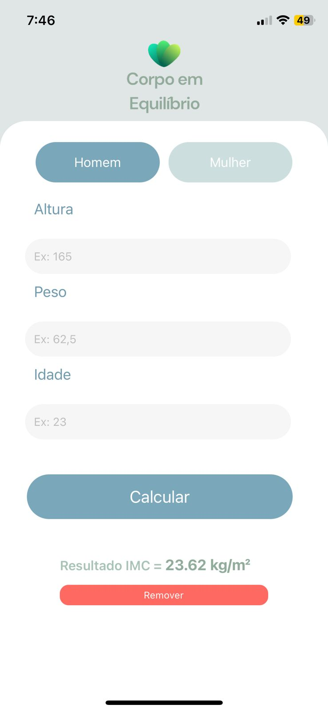
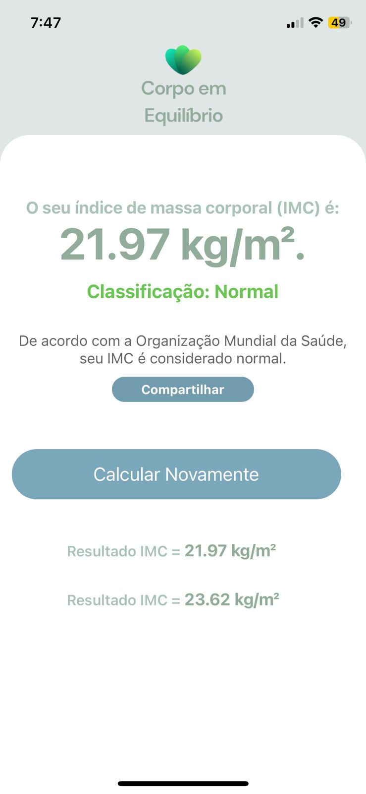

# Calculadora de IMC em React Native

Este é um projeto de aplicativo React Native para calcular o Índice de Massa Corporal (IMC) com várias funcionalidades úteis. A aplicação permite aos usuários inserir informações como altura, peso e idade para calcular o IMC, além de oferecer funcionalidades adicionais. Abaixo estão as principais funcionalidades do projeto:

  
  

## Funcionalidades

### 1. Cálculo do IMC

- Os usuários podem inserir sua altura, peso e idade nos campos correspondentes.
- Ao pressionar o botão "Calcular", a aplicação calcula o IMC com base nas informações fornecidas.

### 2. Classificação de Peso

- A classificação de peso é exibida conforme as diretrizes da Organização Mundial da Saúde (OMS).

### 3. Compartilhamento de Resultados

- Um botão de compartilhamento permite aos usuários compartilhar o resultado do IMC com outras pessoas.

### 4. Histórico de Resultados

- Os resultados anteriores do IMC são exibidos em uma lista usando FlatList.
- Os usuários podem remover entradas do histórico, proporcionando uma experiência interativa.

### 5. Seleção de Gênero

- Botões de seleção de gênero permitem que os usuários escolham entre masculino e feminino.

### 6. Alertas de Campos Vazios

- A aplicação alerta o usuário quando algum campo obrigatório está vazio.
- O dispositivo vibra para fornecer feedback tátil quando ocorrem alertas.

Este projeto oferece uma maneira simples e interativa para os usuários acompanharem seu IMC e compartilharem resultados com facilidade. Além disso, o histórico de resultados proporciona uma visão mais abrangente do progresso ao longo do tempo.
